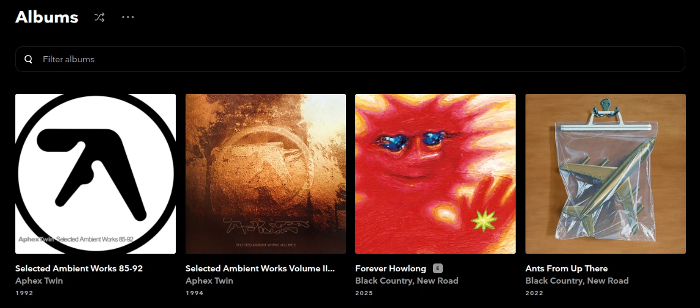

# [TidaLuna](https://github.com/Inrixia/TidaLuna) Plugins

## List of plugins

### [LuckyLP](https://github.com/Akasiek/tidaluna-plugins/tree/main/plugins/LuckyLP)

Plugin that adds a button for getting a random album from the library.

## How to install

1. Install [TidaLuna](https://github.com/Inrixia/TidaLuna)
2. Head over to the `Settings > Luna Settings > Plugin Store`
3. Find the plugin you want to install and click on it